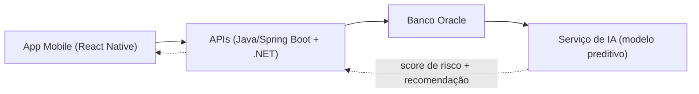

# Documentação Técnica — Componente de IA do VetFlow

**Projeto:** VetFlow (CLYVO VET) · **Sprint:** 3 · **Escopo:** definição e documentação do componente de Inteligência Artificial

---

## 1. Contexto

O VetFlow já opera com quatro camadas integradas: um app mobile em React Native (cadastro de pets, histórico e lembretes), uma API principal em Java/Spring Boot (pets, tutores, consultas, vacinas, medicamentos, histórico clínico), uma API complementar em .NET (clínicas parceiras, agendamentos, notificações) e um banco Oracle com a modelagem relacional de todas as entidades. A infraestrutura é containerizada com Docker e publicada em uma VM Linux na Azure. A arquitetura corporativa (visão, negócio, sistema, tecnologia) já está documentada em TOGAF, no Archi.

Esta sprint adiciona a essa base um **componente de Inteligência Artificial** — um novo serviço que consome os dados já existentes para antecipar cuidado, em vez de apenas registrá-lo.

---

## 2. Problema de Negócio

Hoje, o tutor só aciona a clínica em situações **reativas**: uma urgência, uma vacina já vencida, um sintoma agudo. Isso gera três consequências mensuráveis dentro da jornada contínua de cuidado do pet:

| Consequência | Descrição |
|---|---|
| **Baixa recorrência e menor LTV** | O tutor só volta em emergência — a clínica perde relacionamento e receita recorrente ao longo do tempo. |
| **Histórico clínico fragmentado** | Sem continuidade entre consultas, cada atendimento recomeça do zero, sem visão do caso completo. |
| **Abandono de tratamentos e vacinas** | Sem alertas preventivos, doses e retornos ficam para trás até virar urgência de novo. |

O componente de IA existe para fechar exatamente essa lacuna: transformar dados já coletados (mas hoje passivos) em ação preventiva.

---

## 3. Abordagem de IA Escolhida

**Modelo preditivo** (classificação binária de risco), com saída em forma de *score* contínuo (0 a 1) por pet.

### Por que não as outras abordagens

| Abordagem | Por que não foi escolhida |
|---|---|
| IA Generativa / LLM | Forte em linguagem livre; o problema aqui é numérico e histórico, não conversacional. |
| Motor de regras | Rígido — exigiria reescrever regras manualmente a cada novo padrão de comportamento observado. |
| Sistema de recomendação puro | Sugere itens, mas não resolve a pergunta central: **quando** agir. |

### Por que modelo preditivo

Os dados do VetFlow já são estruturados e relacionais no Oracle — histórico de vacinas, consultas e medicações formam *features* prontas para um modelo supervisionado. É também a abordagem tecnicamente mais viável dentro do prazo da sprint e a que está alinhada ao conteúdo estudado em aula.

---

## 4. Dados Necessários

| Categoria | Origem (Oracle) | Estrutura (campos-chave) | Uso no modelo |
|---|---|---|---|
| Perfil do pet | tabela `PET` | espécie, raça, porte, idade | define a linha de base individual de risco (ex.: intervalo de vacina esperado varia por espécie/porte) |
| Histórico de vacinas | tabela `VACINA` | data de aplicação, próxima dose prevista | calcula o atraso relativo (`dias desde a última vacina ÷ intervalo esperado`) |
| Consultas | tabela `CONSULTA` | data, motivo, retorno recomendado | tempo desde a última consulta; sinaliza ausência de acompanhamento |
| Medicações | tabela `MEDICACAO` | prescrição ativa, duração | adesão ao tratamento; medicação ativa sem acompanhamento é sinal de risco |
| Eventos clínicos | tabela `EVENTO_CLINICO` | diagnóstico, exame, ocorrência | contextualiza gravidade do histórico |
| Comportamento | registros do app (tutor) | ocorrências reportadas | sinal complementar de bem-estar entre consultas |

Todos os dados já existem no fluxo atual do VetFlow — não é necessário coletar nada novo para o primeiro modelo.

---

## 5. Estratégia de Personalização

A personalização acontece em **três camadas**, todas fundamentadas nos dados acima:

**5.1 — Score de risco individual, não um limite fixo.**
Em vez de aplicar a mesma regra a todos os pets ("atrasou X dias = alerta"), o modelo calcula o atraso *relativo ao que é esperado para aquele pet* — o intervalo de vacina esperado varia por espécie e porte, e a idade, histórico de faltas, adesão a tratamentos e alertas comportamentais entram juntos no cálculo. Dois pets com o mesmo atraso em dias podem receber scores de risco muito diferentes. Isso foi validado no protótipo (`ai-prototipo/modelo_preditivo_prototipo.ipynb`): um filhote com atraso de 15% recebeu score 0,70, enquanto um pet idoso com o mesmo atraso relativo, mas com medicação ativa e baixa adesão, recebeu score 0,998.

**5.2 — Priorização dinâmica para a clínica.**
A lista de contato da clínica não é ordenada por data de cadastro ou ordem alfabética — é ordenada pelo score de risco calculado pet a pet, recalculado a cada novo dado (consulta, vacina, medicação) registrado no sistema.

**5.3 — Recomendação de ação ajustada ao contexto do pet.**
A ação sugerida varia conforme o fator de maior peso no score daquele pet: vacina vencida sugere agendamento de reforço vacinal; baixa adesão a medicação sugere contato de acompanhamento de tratamento; ausência prolongada de consulta sugere retorno de rotina. A mesma "prioridade alta" gera recomendações diferentes dependendo de qual dado a originou.

---

## 6. Arquitetura de Integração

O app mobile é o ponto de contato do tutor. As APIs (Java para o núcleo — pets, tutores, consultas, vacinas, medicamentos, histórico — e .NET para clínicas parceiras, agendamentos e notificações) leem e gravam no Oracle. O serviço de IA se conecta à mesma base, processa o histórico estruturado e calcula o score de risco. A previsão retorna pelas APIs até o app do tutor e o painel da clínica.

---

## 7. Fluxo de Dados

1. **Tutor interage** — cadastra o pet, registra sintomas ou consulta o histórico no app mobile.
2. **API registra** — Java (Spring Boot) e .NET gravam e consultam os dados no Oracle.
3. **IA processa** — o serviço de IA lê o histórico estruturado e calcula o score de risco (com a personalização descrita na seção 5).
4. **App recomenda** — tutor e clínica recebem a prioridade e a ação sugerida, no momento certo.

---

## 8. Protótipo (Prova de Conceito)

O arquivo [`ai-prototipo/modelo_preditivo_prototipo.ipynb`](../ai-prototipo/modelo_preditivo_prototipo.ipynb) — pronto para abrir e rodar direto no Google Colab — implementa uma versão simplificada do modelo com dados sintéticos (não são dados reais de produção), para validar a viabilidade técnica antes da integração com as APIs:

- Gera um conjunto sintético de pets com os mesmos campos descritos na seção 4.
- Treina uma regressão logística (scikit-learn) para prever risco de abandono de cuidado.
- Resultado na validação: 0,91 nos dados sintéticos.
- Demonstra a personalização da seção 5.1 com um exemplo comparativo de dois pets.
- Gera `exemplo_dados.csv` — uma lista priorizada de exemplo, no formato que seria consumido pelas APIs.

Este protótipo é um passo intermediário: o modelo de produção será treinado com dados reais do Oracle, seguindo a mesma lógica de *features*.

---

## 9. Próximos Passos

1. Treinar o modelo com dados reais (ou simulados de forma mais representativa) do VetFlow.
2. Expor o serviço de IA como um endpoint interno, consumido pelas APIs Java/.NET.
3. Validar o score de risco com casos reais de clínica antes de liberar a priorização automática.
